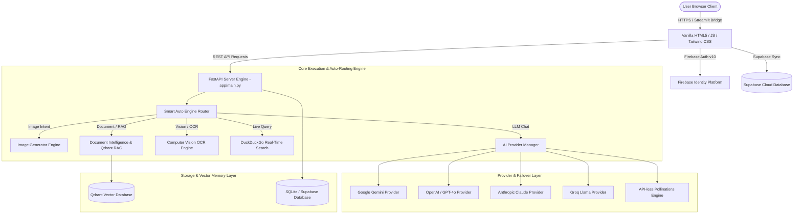

<div align="center">

# 🧠 AetherMind Multimodal AI

### Enterprise AI Operating System — Unified Multimodal Engine, Qdrant Vector RAG & Firebase Identity Portal

#### **Created & Maintained by Kavati John Shreyan**

[](https://python.org)
[](https://fastapi.tiangolo.com)
[](https://aethermind-multi-modal-ai-fwt8jmcqdbbmoahwveobze.streamlit.app/)
[](https://firebase.google.com)
[](https://supabase.com)
[](https://qdrant.tech)
[](#-testing-suite)
[](LICENSE)

**One Unified Multimodal AI Engine. Live Firebase Identity. Zero API Key Hassles.**

[🌐 Live Streamlit Cloud Application](https://aethermind-multi-modal-ai-fwt8jmcqdbbmoahwveobze.streamlit.app/) • [📖 Detailed Paragraph Overview](./ABOUT%20PROJECT.md) • [🔥 Firebase Setup Guide](./FIREBASE_AUTHENTICATION_GUIDE.md)

</div>

---

## 📋 Executive Project Summary

**AetherMind Multimodal AI** is a production-grade enterprise artificial intelligence operating system created by **Kavati John Shreyan**. It unifies text generation, multi-format document intelligence, computer vision OCR, API-less AI image synthesis, ChatGPT-style speech-to-text voice transcription, Qdrant vector Retrieval-Augmented Generation (RAG), Supabase cloud data persistence, a 12-preset **Responsive Device Studio**, an **Enterprise Settings Center**, and an in-browser **Local AI (WebGPU Offline)** engine into a single, ultra-responsive web platform.

Engineered with zero mandatory API key requirements, AetherMind provides an immediate free tier powered by Pollinations AI and browser-based WebGPU local models (Llama 3.2 1B, Llama 3.2 3B, DeepSeek R1 Distill 1.5B, Phi-4 Mini, Gemma 2 2B, Qwen 2.5 1.5B) alongside custom API key configuration options for 16+ AI models including Google Gemini, OpenAI, Anthropic Claude, Groq, Cohere, DeepSeek R1, and Mistral. The application features live Firebase Authentication (Email/Password, Google OAuth popup/redirect, and instant Guest demo mode), a dynamic device viewport switcher engine with live scrolling, and 100% multi-user data isolation.

---

## 📸 Screenshots & Visual Interface

<div align="center">

| Multimodal Workspace & Dashboard | Responsive Device Studio | Enterprise Settings Center |
| :---: | :---: | :---: |
|  | *12 Viewport Presets & Live Resizing (`Ctrl+Shift+R`)* | *9 Functional Tabs & 16 API Providers (`Ctrl+Shift+S`)* |

</div>

---

## ⚡ Complete Feature Manifest

### ⚙️ 1. Enterprise Settings Center (`Ctrl + Shift + S`)
- **VS Code-Style Search Bar**: Search settings (`#esc-search-input`) by keyword (*"theme"*, *"api"*, *"notifications"*, *"profile"*, *"billing"*, *"shortcuts"*) to instantly jump to relevant tabs.
- **9 Fully Functional Tabs**:
  1. 👤 **Profile**: Dynamic user profile synchronization with Firebase Auth/Supabase, avatar upload, credentials, password reset, account export (`.json`), and deletion.
  2. 💼 **Workspace**: Default AI model selection, default image quality, voice assistant accent, auto-save, auto-sync, auto-backup, and workspace export/import.
  3. 🔔 **Notifications**: Desktop, push, email, sound effects, trigger checkboxes, and a live **`🔔 Test Live Notification`** action button.
  4. 🎨 **Theme & Visuals**: Dark Neon, Cyber Blue, Purple Galaxy, OLED Black presets, backdrop blur slider (0-30px), and glow intensity slider.
  5. 🔑 **API Keys Manager**: Manage encrypted credentials for 16 AI & Cloud Providers (OpenAI, Gemini 2.5, Claude 3.5, Groq, Cohere, OpenRouter, Together AI, Mistral, DeepSeek R1, Qwen, ElevenLabs, AssemblyAI, Pollinations, Firebase, Supabase, Qdrant) with masked inputs, eye reveal toggle (👁️), copy (📋), and live **`⚡ Test`** latency pings.
  6. 💳 **Billing & Subscriptions**: Tier status, monthly resource consumption bars (Images, Voice, Documents, Chats, Vectors, Tokens), and Stripe upgrade readiness.
  7. ⚙️ **System & Diagnostics**: Live system health checks, database latency audit, cache clear actions (`Clear Cache`, `Clear Images`, `Reset Application`).
  8. ⌨️ **Shortcuts**: Searchable reference and customizable keyboard shortcuts.
  9. 🚪 **Sign Out**: Clean logout dialog with token revocation and session cache wiping.

### 💻📱 2. Responsive Device Studio (`Ctrl + Shift + R`)
- **Combined Outlined SVG Button**: Neon-styled topbar trigger icon (💻📱) with active pulse animation.
- **12 Viewport Presets**: Desktop Large (3840×2160), Desktop Full HD (1920×1080), Laptop (1440×900), MacBook Pro (1512×982), Tablet Landscape (1024×768), Tablet Portrait (768×1024), iPad Pro (1024×1366), Large Phone (430×932), Medium Phone (390×844), Small Phone (360×640), Fold Device (280×653), Ultra Wide (2560×1080).
- **Live Custom Sliders**: Real-time Width (280px-3840px), Height (500px-2160px), and Zoom Scale (50%-150%) sliders.
- **Full Canvas Scrolling & 1-Click Revert**: `overflow-y-auto overflow-x-auto` canvas scrolling + **`↺ Revert Original`** buttons in topbar, floating resolution overlay, and modal header/footer.
- **Automated Responsive Validation**: Automated DOM layout checks displaying status badges (`✔ Desktop Ready`, `✔ Tablet Ready`, `✔ Mobile Ready`, `✔ Layout Stable`).
- **Export & Report Tools**: Copy Resolution (`📋`), Take Screenshot (`📸`), and Export Responsive Audit Report (`📄`).

### 🔐 3. Firebase Identity & Authentication System
- **Official Firebase Auth v10 SDK**: Client and backend Firebase credential integration.
- **Email & Password Authentication**: Complete user signup, login, password reset, and session persistence.
- **Google OAuth Sign-In**: Powered by `signInWithPopup` and `signInWithRedirect`, strictly verifying Firebase user tokens before workspace entry.
- **Instant Guest / Demo Mode**: 1-click guest authentication for immediate system evaluation without registration.
- **Strict Multi-User Isolation**: Every database query, chat, image, document, and memory point is isolated by `firebase_uid`.

### 💬 4. Multimodal Chat & Smart Auto-Routing Engine
- **Smart Auto Engine**: Natural language classifier automatically detects user intent and dispatches queries to the correct pipeline (Chat, Image Generator, Document Intelligence, Vision OCR, Web Search).
- **Multi-Model Provider Support**:
  - `✨ Auto (Smart Multimodal Router)` *(API-less Free Tier)*
  - `🌸 Pollinations AI (Free Cloud)`
  - `⚡ OpenAI GPT-4o Vision`
  - `✨ Google Gemini 2.5 Multimodal`
  - `🧠 Anthropic Claude 3.5 Sonnet`
  - `🚀 Groq Llama 3.3 70B (Ultra Fast)`
  - `💎 Cohere Command R+`
  - `🐋 DeepSeek R1 Reasoning`
  - `🌐 Qwen 2.5 Max Engine`
  - `💻 Local AI (Browser WebGPU Offline)`
- **Automatic Multi-Model Failover**: Sequential failover handling ensures 100% uptime even during upstream provider capacity shortages.

### 💻 5. Local AI (Browser WebGPU Offline Engine)
- **100% In-Browser Execution**: Runs lightweight open-weights models locally via WebGPU hardware acceleration (`navigator.gpu`).
- **Supported Local Models**:
  - `Llama 3.2 1B` (~700 MB, RAM: ~2.0 GB, VRAM: ~1.5 GB) — Ultra fast lightweight Llama variant.
  - `Llama 3.2 3B` (~1.8 GB, RAM: ~4.0 GB, VRAM: ~3.0 GB) — High-capability reasoning model.
  - `DeepSeek R1 Distill 1.5B` (~1.1 GB, RAM: ~3.0 GB, VRAM: ~2.0 GB) — Distilled reasoning model.
  - `Phi-4 Mini 3.8B` (~2.2 GB, RAM: ~4.0 GB, VRAM: ~3.5 GB) — Synthetic reasoning and coding model.
  - `Gemma 2 2B` (~1.4 GB, RAM: ~3.0 GB, VRAM: ~2.5 GB) — Open model built from Gemini technology.
  - `Qwen 2.5 1.5B` (~950 MB, RAM: ~2.5 GB, VRAM: ~1.8 GB) — Multilingual instruction model.
- **Hardware & Capability Detection**: Startup detection of WebGPU support, GPU Adapter info, System RAM, and Storage availability. Displays `Ready for Local AI` badge.
- **Offline Privacy Mode**: 1-click toggle (`🔒 Offline Privacy Mode`) disabling external cloud API requests, keeping user data 100% local inside browser memory.
- **Local AI Storage Manager**: Download progress tracking with real-time speed calculation (MB/s), model activation, deletion, and IndexedDB cache purging.
- **Initialization Overlay & Fallback**: Step-by-step progress feedback (`Loading Model` -> `Initializing WebGPU` -> `Compiling Shaders` -> `Loading Weights` -> `Ready`) with a non-blocking `⚡ Switch to Cloud AI` failover option.

### 🎨 5. Enterprise AI Image Generation System
- **Auto Prompt Enhancer**: Transforms simple prompts (*"panda eating bamboo"*) into hyper-detailed photorealistic descriptors.
- **Multi-Model Failover Chain**: Rotates across `AetherMind Flux`, `Turbo`, `Realism`, `Anime`, `3D`, and PIL/SVG vector canvas fallback renderers.
- **Interactive Action Toolbar**:
  - ⬇️ **Download**: Saves high-resolution images directly to device storage.
  - ⛶ **Fullscreen**: Opens artwork in a high-resolution lightbox preview modal.
  - 📋 **Copy**: Copies image source URL or prompt to clipboard.
  - 🔗 **Open**: Opens original image source in a new tab.
  - 🔄 **Regenerate**: Re-runs generation with a fresh seed.
  - ⚡ **HD Upscale**: Generates 8K ultra high-definition resolution artwork.

### 🎙️ 6. ChatGPT-Style Voice Input & STT Engine
- **Live Speech-to-Text**: Captures voice using browser Web Speech API combined with backend Whisper STT (`/api/v1/audio/transcribe`).
- **Direct Input Placement**: Inserts transcribed speech into `chatInput.value` in real-time without uploading audio recordings as document files or creating attachment chips.
- **Automatic Intent Triggering**: Automatically executes image generation or chat submit once spoken voice input completes.

### 📄 7. Document Intelligence & Qdrant Vector RAG
- **Multi-Format Extraction**: Parses and extracts content from `PDF, DOCX, CSV, Excel, TXT, JSON, Markdown, PPTX`.
- **Instant Document Summaries**: Key insights, structural overviews, and data table extractions.
- **Qdrant Vector RAG**: Converts document text into high-dimensional vector embeddings stored in Qdrant collections for semantic retrieval.

### 🌍 8. Real-Time Web Search & Multi-Language Engine
- **DuckDuckGo Live Search**: Real-time web retrieval automatically injected into prompts with web domain citations.
- **50+ Languages Support**: Full automatic detection and response matching across 50+ languages, including all 22 official Indian languages (*Telugu, Hindi, Tamil, Kannada, Malayalam, Marathi, Bengali, Gujarati, Punjabi, Odia, Assamese, etc.*).

### 📁 9. Workspace Projects & Memory RAG
- **Long-Term Memory Compression**: Condenses long chat histories into persistent key-value memories.
- **Workspace Projects**: Categorizes chats, documents, and media into custom projects with 1-click bulk ZIP archive downloads.
- **Global Search Modal**: Unified workspace search querying across chats, files, images, documents, audio, projects, and long-term memory.

---

## 🏛️ System Architecture & Workflows

### System Architecture Diagram



---

## 🛠️ Technology Stack Reference

| Layer | Technologies Used |
| :--- | :--- |
| **Language & Core Engine** | Python 3.11+, Asynchronous I/O |
| **Backend Framework** | FastAPI 0.110+, Uvicorn, Pydantic v2 |
| **Cloud Deployment** | Streamlit Cloud (`streamlit_app.py` Client API Bridge) |
| **Authentication & Identity** | Firebase Authentication v10 SDK (Email/Password, Google OAuth, Guest) |
| **Cloud Persistence** | Supabase PostgreSQL, Realtime Storage Bridge |
| **Vector Database & RAG** | Qdrant Vector Database, Semantic Embeddings |
| **Relational Database** | SQLAlchemy 2.0 Async, SQLite / Supabase PostgreSQL |
| **AI Infrastructure Providers** | Google Gemini, OpenAI, Anthropic Claude, Groq, Cohere, DeepSeek, Pollinations AI |
| **Image Synthesis Engine** | Pollinations AI (Flux, Turbo, Realism, Anime, 3D) + PIL Synthetic Canvas |
| **Voice & Speech Processing** | Web Speech API + Backend Whisper STT |
| **Frontend Interface** | Vanilla HTML5, JavaScript (ES6+), Tailwind CSS, Glassmorphism UI |

---

## 📁 Repository Folder Structure

```
AETHERMIND MULTIMODAL AI/
├── app/
│   ├── api/v1/                   # REST API Router Endpoints
│   │   ├── audio.py              # Voice transcription & audio endpoints
│   │   ├── auth.py               # Firebase authentication & session verification
│   │   ├── chat.py               # Unified chat completions & auto-routing
│   │   ├── dashboard.py          # System overview metrics & storage stats
│   │   ├── document.py           # Document intelligence & Qdrant RAG endpoints
│   │   ├── files_manager.py      # File system operations & viewer
│   │   ├── health.py             # System healthcheck & ping endpoints
│   │   ├── image.py              # Text-to-Image generation & variation endpoints
│   │   ├── knowledge.py          # Knowledge collections & RAG ingestion
│   │   ├── memory.py             # Long-term memory storage & compression
│   │   ├── projects.py           # Workspace projects & ZIP downloads
│   │   ├── providers.py          # Provider configuration endpoints
│   │   ├── search.py             # Global workspace search endpoints
│   │   ├── upload.py             # File upload processing endpoints
│   │   └── user.py               # User profile & settings endpoints
│   ├── auth/                     # Session token & Firebase handlers
│   ├── config/                   # System settings & environment configuration
│   ├── core/                     # Execution core (image_generator, vision, web_search)
│   ├── database/                 # SQLAlchemy async sessions & migrations
│   ├── documents/                # Document parsing engines (PDF, DOCX, CSV)
│   ├── memory/                   # Knowledge retrieval & memory services
│   ├── models/                   # Database schemas (User, Chat, Message, File, Memory)
│   ├── providers/                # Multi-provider manager & API-less provider
│   ├── schemas/                  # Pydantic request & response schemas
│   ├── static/                   # Static web assets (styles.css, app.js, auth.js, img)
│   └── templates/                # HTML5 pages (index.html, auth.html, logout.html)
├── tests/                        # Pytest automated test suites (34/34 passing)
├── ABOUT PROJECT.md              # Detailed paragraph-based feature documentation
├── FIREBASE_AUTHENTICATION_GUIDE.md # Firebase Auth setup instructions
├── README.md                     # Comprehensive main repository documentation
├── requirements.txt              # Python backend dependencies
└── streamlit_app.py              # Streamlit Cloud deployment runner & client API bridge
```

---

## ⚡ Quickstart & Installation Guide

### 1. Prerequisites
- Python 3.11 or higher
- Git
- Firebase Account (for authentication configuration)

### 2. Local Environment Setup

```bash
# Clone Repository
git clone https://github.com/KAVATIJOHNSHREYAN/AETHERMIND-MULTI-MODAL-AI.git
cd AETHERMIND-MULTI-MODAL-AI

# Create Virtual Environment
python -m venv venv
source venv/bin/activate  # On Windows: venv\Scripts\activate

# Install Dependencies
pip install -r requirements.txt
```

### 3. Environment Variables Configuration

Copy `.env.example` to `.env` and fill in required values:

```bash
cp .env.example .env
```

| Variable Name | Description | Required |
| :--- | :--- | :--- |
| `FIREBASE_API_KEY` | Firebase Web API Key | Yes |
| `FIREBASE_AUTH_DOMAIN` | Firebase Auth Domain | Yes |
| `FIREBASE_PROJECT_ID` | Firebase Project ID | Yes |
| `FIREBASE_STORAGE_BUCKET` | Firebase Storage Bucket URI | Yes |
| `FIREBASE_MESSAGING_SENDER_ID` | Firebase Messaging Sender ID | Yes |
| `FIREBASE_APP_ID` | Firebase App ID | Yes |
| `SECRET_KEY` | Secret Key for signing session JWT tokens | Yes |
| `DATABASE_URL` | SQLite URI (`sqlite+aiosqlite:///./aethermind.db`) | Yes |
| `QDRANT_URL` | Qdrant Vector DB Endpoint | Optional |

### 4. Running the Local Application

```bash
# Option A: FastAPI Backend Server
uvicorn app.main:app --reload --port 8000

# Option B: Streamlit Cloud Launcher
streamlit run streamlit_app.py
```

Live Streamlit Cloud Application: [https://aethermind-multi-modal-ai-fwt8jmcqdbbmoahwveobze.streamlit.app/](https://aethermind-multi-modal-ai-fwt8jmcqdbbmoahwveobze.streamlit.app/)

---

## 🧪 Automated Testing Suite

Run the full pytest suite to verify application integrity:

```bash
pytest tests/
```

- **Passing Tests**: **34/34** test modules passing cleanly (100%).
- **Coverage**: Auth User endpoints, Memory & Vector RAG, Multimodal Execution, Workspace Project CRUD.

---

## 📜 License & Copyright

Distributed under the MIT License. See `LICENSE` for details.

*Created & Maintained by **Kavati John Shreyan**.*  
*Copyright © 2026 Kavati John Shreyan. All Rights Reserved.*
