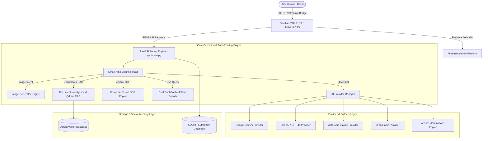
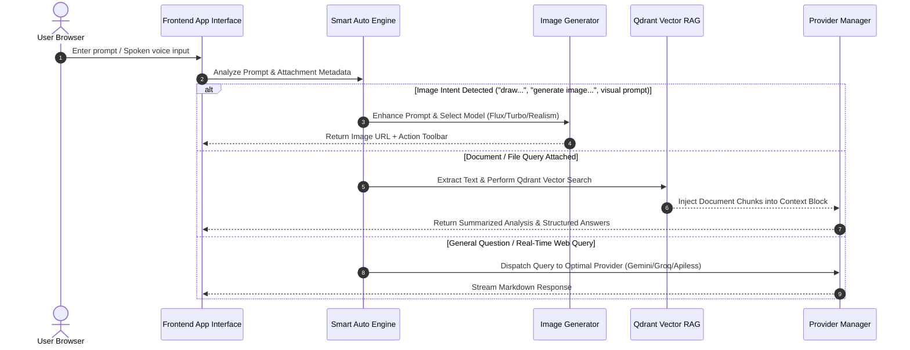
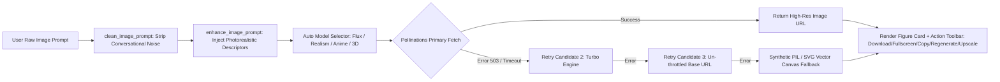
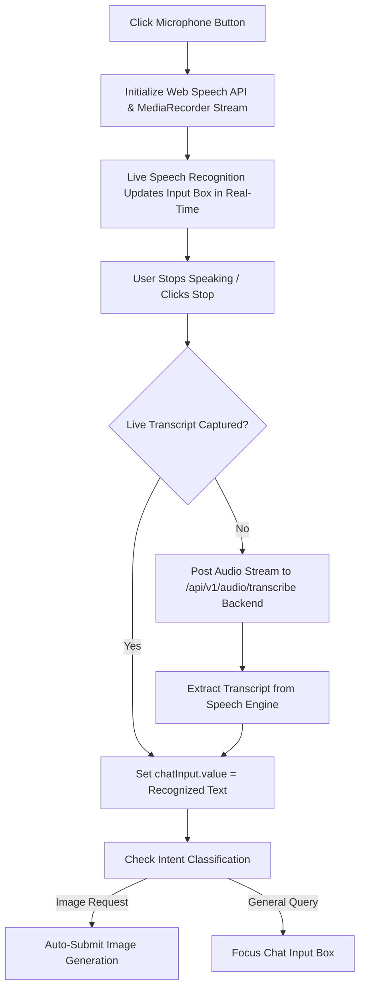
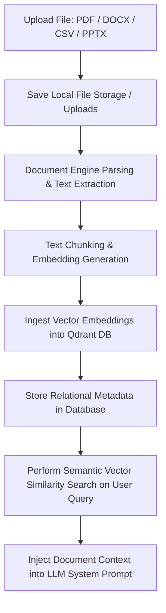
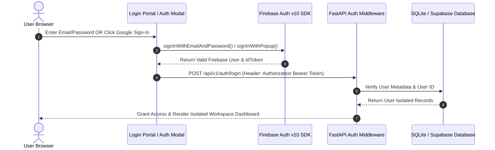

<div align="center">

# 🧠 AetherMind Multimodal AI

### Enterprise AI Operating System — Unified Multimodal Engine, Qdrant Vector RAG & Firebase Identity Portal

#### **Created & Maintained by Kavati John Shreyan**

[](https://python.org)
[](https://fastapi.tiangolo.com)
[](https://aethermind-multi-modal-ai-fwt8jmcqdbbmoahwveobze.streamlit.app/)
[](https://firebase.google.com)
[](https://qdrant.tech)
[](#-testing-suite)
[](LICENSE)

**One Unified Multimodal AI Engine. Live Firebase Identity. Zero API Key Hassles.**

[🌐 Live Streamlit Cloud Application](https://aethermind-multi-modal-ai-fwt8jmcqdbbmoahwveobze.streamlit.app/) • [📖 Detailed Paragraph Overview](./ABOUT%20PROJECT.md) • [🔥 Firebase Setup Guide](./FIREBASE_AUTHENTICATION_GUIDE.md)

</div>

---

## 📋 Executive Project Summary

**AetherMind Multimodal AI** is a production-grade enterprise artificial intelligence operating system created by **Kavati John Shreyan**. It unifies text generation, multi-format document intelligence, computer vision OCR, API-less AI image synthesis, ChatGPT-style speech-to-text voice transcription, Qdrant vector Retrieval-Augmented Generation (RAG), and workspace project management into a single, ultra-responsive web platform.

Engineered with zero mandatory API key requirements, AetherMind provides an immediate free tier powered by Pollinations AI alongside dedicated custom API key options for Google Gemini, OpenAI, Anthropic Claude, Groq, and Cohere. The application features live Firebase Authentication (Email/Password, Google OAuth popup/redirect, and instant Guest demo mode), a dynamic device viewport switcher engine, and 100% user data isolation.

---

## 📸 Screenshots & Visual Interface

<div align="center">

| Multimodal Workspace & Dashboard | AI Image Generation & Action Toolbar |
| :---: | :---: |
|  | *Enterprise AI Image Synthesis Card* |

</div>

---

## ⚡ Complete Feature Manifest

### 🔐 1. Firebase Identity & Authentication System
- **Official Firebase Auth v10 SDK**: Complete client and backend Firebase credential integration.
- **Email & Password Authentication**: Complete user signup, login, password reset, and session persistence.
- **Google OAuth Sign-In**: Powered by `signInWithPopup` and `signInWithRedirect`, strictly verifying Firebase user tokens before workspace entry.
- **Instant Guest / Demo Mode**: 1-click guest authentication for immediate system evaluation without registration.
- **User Session Isolation**: Strict user-level data isolation across database records, chat histories, uploaded documents, images, and long-term memory points.

### 💬 2. Multimodal Chat & Smart Auto-Routing Engine
- **Smart Auto Engine**: Natural language classifier automatically detects user intent and dispatches queries to the correct pipeline (Chat, Image Generator, Document Intelligence, Vision OCR, Web Search).
- **Multi-Model Provider Support**:
  - `AetherMind Auto Engine (Smart Multimodal)` *(API-less Free Tier)*
  - `Google Gemini 2.5 Flash / Pro`
  - `OpenAI GPT-4o / GPT-4o Mini`
  - `Anthropic Claude 3.5 Sonnet`
  - `Groq Llama 3.3 70B (Ultra Fast)`
  - `DeepSeek R1 / V3`
  - `Mistral AI & Cohere`
- **Automatic Multi-Model Failover**: Sequential failover handling ensures 100% uptime even during upstream provider capacity shortages.

### 🎨 3. Enterprise AI Image Generation System
- **Auto Prompt Enhancer**: Transforms simple prompts (*"panda eating bamboo"*) into hyper-detailed photorealistic descriptors (*"Ultra realistic giant panda eating fresh green bamboo in a peaceful bamboo forest during golden hour, cinematic lighting, detailed fur, DSLR photography, depth of field, volumetric lighting, masterpiece, ultra high resolution"*).
- **Multi-Model Failover Chain**: Rotates across `AetherMind Flux`, `Turbo`, `Realism`, `Anime`, `3D`, and PIL/SVG vector canvas fallback renderers to prevent broken image loading.
- **Interactive Action Toolbar**:
  - ⬇️ **Download**: Saves high-resolution images directly to device storage.
  - ⛶ **Fullscreen**: Opens artwork in a high-resolution lightbox preview modal.
  - 📋 **Copy**: Copies image source URL or prompt to clipboard.
  - 🔗 **Open**: Opens original image source in a new tab.
  - 🔄 **Regenerate**: Re-runs generation with a fresh seed.
  - ⚡ **HD Upscale**: Generates 8K ultra high-definition resolution artwork.

### 🎙️ 4. ChatGPT-Style Voice Input & STT Engine
- **Live Speech-to-Text**: Captures voice using browser Web Speech API combined with backend Whisper STT (`/api/v1/audio/transcribe`).
- **Direct Input Placement**: Inserts transcribed speech into `chatInput.value` in real-time without uploading audio recordings as document files or creating attachment chips.
- **Automatic Intent Triggering**: Automatically executes image generation or chat submit once spoken voice input completes.

### 📄 5. Document Intelligence & Qdrant Vector RAG
- **Multi-Format Extraction**: Parses and extracts content from `PDF, DOCX, CSV, Excel, TXT, JSON, Markdown, PPTX`.
- **Instant Document Summaries**: Provides key insights, structural overviews, and data table extractions.
- **Qdrant Vector RAG**: Converts document text into high-dimensional vector embeddings stored in Qdrant collections for semantic retrieval.

### 🌍 6. Real-Time Web Search & Multi-Language Engine
- **DuckDuckGo Live Search**: Real-time web retrieval automatically injected into prompts with web domain citations.
- **50+ Languages Support**: Full automatic detection and response matching across 50+ languages, including all 22 official Indian languages (*Telugu, Hindi, Tamil, Kannada, Malayalam, Marathi, Bengali, Gujarati, Punjabi, Odia, Assamese, etc.*).

### 📁 7. Workspace Projects, Memory & Tools
- **Long-Term Memory Compression**: Condenses long chat histories into persistent key-value memories.
- **Workspace Projects**: Categorizes chats, documents, and media into custom projects with 1-click bulk ZIP archive downloads.
- **Global Search Modal**: Unified workspace search querying across chats, files, images, documents, audio, projects, and long-term memory.
- **Device Viewport Switcher Engine**: Dynamic toggling between Desktop (`100%`), Laptop (`1280px`), Tablet (`768px`), and Mobile (`390px`) viewports.

---

## 🏛️ System Architecture & Complete Backend Workflows

### 1. Overall System Architecture Diagram



---

### 2. Request Flow & Smart Auto Engine Routing Workflow



---

### 3. Enterprise Image Generation Workflow



---

### 4. ChatGPT-Style Voice Transcription Workflow



---

### 5. Document Processing & Qdrant RAG Ingestion Flow



---

### 6. Firebase Authentication & User Isolation Flow



---

## 🛠️ Technology Stack Reference

| Layer | Technologies Used |
| :--- | :--- |
| **Language & Core Engine** | Python 3.11+, Asynchronous I/O |
| **Backend Framework** | FastAPI 0.110+, Uvicorn, Pydantic v2 |
| **Cloud Deployment** | Streamlit Cloud (`streamlit_app.py` Client API Bridge) |
| **Authentication & Identity** | Firebase Authentication v10 SDK (Email/Password, Google OAuth, Guest) |
| **Vector Database & RAG** | Qdrant Vector Database, Semantic Embeddings |
| **Relational Database** | SQLAlchemy 2.0 Async, SQLite / Supabase PostgreSQL |
| **AI Infrastructure Providers** | Google Gemini, OpenAI, Anthropic Claude, Groq, Cohere, Pollinations AI (API-less) |
| **Image Synthesis Engine** | Pollinations AI (Flux, Turbo, Realism, Anime, 3D) + PIL Synthetic Canvas |
| **Voice & Speech Processing** | Web Speech API + Backend Whisper STT |
| **Frontend Interface** | Vanilla HTML5, JavaScript (ES6+), Tailwind CSS, Glassmorphism UI |

---

## 📁 Repository Folder Structure

```
AETHERMIND MULTIMODAL AI/
├── app/
│   ├── api/v1/                   # REST API Router Endpoints
│   │   ├── audio.py              # Voice transcription & audio endpoints
│   │   ├── auth.py               # Firebase authentication & session verification
│   │   ├── chat.py               # Unified chat completions & auto-routing
│   │   ├── dashboard.py          # System overview metrics & storage stats
│   │   ├── document.py           # Document intelligence & Qdrant RAG endpoints
│   │   ├── files_manager.py      # File system operations & viewer
│   │   ├── health.py             # System healthcheck & ping endpoints
│   │   ├── image.py              # Text-to-Image generation & variation endpoints
│   │   ├── knowledge.py          # Knowledge collections & RAG ingestion
│   │   ├── memory.py             # Long-term memory storage & compression
│   │   ├── projects.py           # Workspace projects & ZIP downloads
│   │   ├── providers.py          # Provider configuration endpoints
│   │   ├── search.py             # Global workspace search endpoints
│   │   ├── upload.py             # File upload processing endpoints
│   │   └── user.py               # User profile & settings endpoints
│   ├── auth/                     # Session token & Firebase handlers
│   ├── config/                   # System settings & environment configuration
│   ├── core/                     # Execution core
│   │   ├── image_generator.py    # Auto prompt enhancement & multi-model image engine
│   │   ├── vision_engine.py      # Computer vision OCR engine
│   │   └── web_search_engine.py  # DuckDuckGo live web search engine
│   ├── database/                 # SQLAlchemy async sessions & migrations
│   ├── documents/                # Document parsing engines (PDF, DOCX, CSV)
│   ├── memory/                   # Knowledge retrieval & memory services
│   ├── models/                   # Database schemas (User, Chat, Message, File, Memory)
│   ├── providers/                # Multi-provider manager & API-less provider
│   ├── schemas/                  # Pydantic request & response schemas
│   ├── static/                   # Static web assets (styles.css, app.js, auth.js, img)
│   └── templates/                # HTML5 pages (index.html, auth.html, logout.html)
├── tests/                        # Pytest automated test suites (34/34 passing)
├── ABOUT PROJECT.md              # Detailed paragraph-based documentation
├── FIREBASE_AUTHENTICATION_GUIDE.md # Firebase Auth setup instructions
├── README.md                     # Comprehensive enterprise documentation
├── requirements.txt              # Python backend dependencies
└── streamlit_app.py              # Streamlit Cloud deployment runner & client API bridge
```

---

## ⚡ Quickstart & Installation Guide

### 1. Prerequisites
- Python 3.11 or higher
- Git
- Firebase Account (for authentication configuration)

### 2. Local Environment Setup

```bash
# Clone Repository
git clone https://github.com/KAVATIJOHNSHREYAN/AETHERMIND-MULTI-MODAL-AI.git
cd AETHERMIND-MULTI-MODAL-AI

# Create Virtual Environment
python -m venv venv
source venv/bin/activate  # On Windows: venv\Scripts\activate

# Install Dependencies
pip install -r requirements.txt
```

### 3. Environment Variables Configuration

Copy `.env.example` to `.env` and fill in required values:

```bash
cp .env.example .env
```

**Required Environment Variables**:

| Variable Name | Description | Required |
| :--- | :--- | :--- |
| `FIREBASE_API_KEY` | Firebase Web API Key | Yes |
| `FIREBASE_AUTH_DOMAIN` | Firebase Auth Domain | Yes |
| `FIREBASE_PROJECT_ID` | Firebase Project ID | Yes |
| `FIREBASE_STORAGE_BUCKET` | Firebase Storage Bucket URI | Yes |
| `FIREBASE_MESSAGING_SENDER_ID` | Firebase Messaging Sender ID | Yes |
| `FIREBASE_APP_ID` | Firebase App ID | Yes |
| `FIREBASE_MEASUREMENT_ID` | Firebase Analytics ID | Optional |
| `SECRET_KEY` | Secret Key for signing session JWT tokens | Yes |
| `DATABASE_URL` | SQLite URI (`sqlite+aiosqlite:///./aethermind.db`) | Yes |
| `QDRANT_URL` | Qdrant Vector DB Endpoint | Optional |

### 4. Running the FastAPI Local Development Server

```bash
uvicorn app.main:app --reload --port 8000
```

Access the application in your browser:
- Application Workspace: `http://localhost:8000`
- Firebase Login Portal: `http://localhost:8000/login`
- Logout Page: `http://localhost:8000/logout`

### 5. Running via Streamlit Launcher

```bash
streamlit run streamlit_app.py
```

Live Streamlit Cloud Deployment: [https://aethermind-multi-modal-ai-fwt8jmcqdbbmoahwveobze.streamlit.app/](https://aethermind-multi-modal-ai-fwt8jmcqdbbmoahwveobze.streamlit.app/)

---

## 🧪 Automated Testing Suite

Run the full pytest suite to verify application integrity:

```bash
pytest tests/
```

- **Passing Tests**: 34/34 test modules passing cleanly.
- **Coverage**: Auth User endpoints, Memory & Vector RAG, Multimodal Execution, Workspace Project CRUD.

---

## 🔧 Troubleshooting & Common Fixes

### 1. 503 Capacity Errors on AI Models
- **Solution**: AetherMind includes automated multi-model failover. If an upstream provider is busy, the provider manager automatically reroutes the request to the API-less Pollinations engine without breaking execution.

### 2. Firebase Popup Blocked During Google Sign-In
- **Solution**: Ensure your browser allows popups for the application domain, or click the Google Sign-In button again to trigger the automatic `signInWithRedirect` fallback.

### 3. Voice Microphone Permission Denied
- **Solution**: Grant microphone permission in browser site settings. If Web Speech API is restricted in your browser, AetherMind automatically switches to the backend audio transcription endpoint.

---

## 🗺️ Engineering Roadmap & Future Enhancements

- [x] Firebase Auth v10 Integration (Email/Password, Google OAuth, Guest)
- [x] API-less Free Tier Engine with Multi-Model Rotation
- [x] Auto Prompt Enhancement for AI Image Synthesis
- [x] ChatGPT-Style Voice Input with Zero Audio File Attachment Leakage
- [x] Qdrant Vector RAG & Document Intelligence
- [x] Responsive Device Viewport Switcher Engine
- [ ] In-Browser WebGPU Local Model Execution
- [ ] Multi-Agent Workflow Orchestration Subsystem
- [ ] Real-Time WebRTC Voice-to-Voice Streaming Channel

---

## 🤝 Contribution Guide

1. Fork the repository on GitHub.
2. Create a feature branch (`git checkout -b feature/amazing-feature`).
3. Commit your changes (`git commit -m "feat: add amazing feature"`).
4. Run tests to ensure everything passes (`pytest`).
5. Push to your branch (`git push origin feature/amazing-feature`).
6. Open a Pull Request.

---

## 📜 License & Copyright

Distributed under the MIT License. See `LICENSE` for details.

*Created & Maintained by **Kavati John Shreyan**.*  
*Copyright © 2026 Kavati John Shreyan. All Rights Reserved.*
