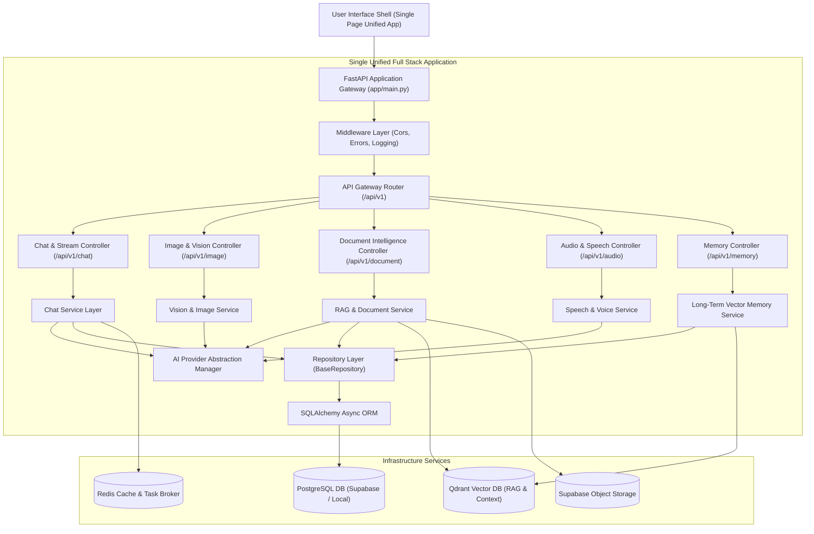
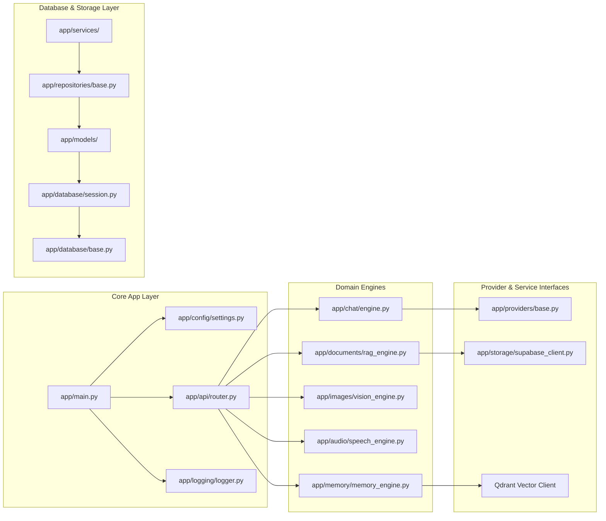
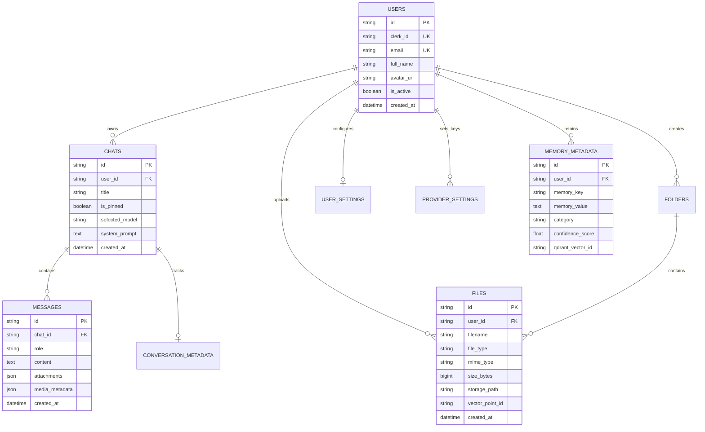
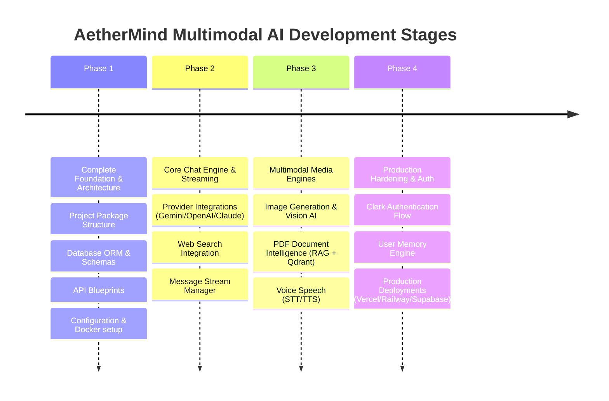

# 🚀 AetherMind Multimodal AI — Phase 1 Enterprise Architecture Blueprint

> **System Overview:** Single Unified Enterprise Multimodal AI Platform Architecture  
> **Architectural Paradigm:** Feature-Based, Layered, Repository & Provider Pattern with Unified Python Full-Stack Runtime  
> **Status:** Phase 1 Foundation Complete  

---

## 1. Complete Enterprise Folder Structure

```
AETHERMIND MULTIMODAL AI/
├── app/
│   ├── api/
│   │   ├── v1/
│   │   │   ├── __init__.py
│   │   │   ├── auth.py
│   │   │   ├── audio.py
│   │   │   ├── chat.py
│   │   │   ├── document.py
│   │   │   ├── health.py
│   │   │   ├── image.py
│   │   │   ├── memory.py
│   │   │   ├── profile.py
│   │   │   ├── providers.py
│   │   │   ├── search.py
│   │   │   ├── settings.py
│   │   │   ├── upload.py
│   │   │   ├── user.py
│   │   │   └── vision.py
│   │   ├── __init__.py
│   │   └── router.py
│   ├── audio/
│   │   ├── __init__.py
│   │   └── speech_engine.py
│   ├── auth/
│   │   ├── __init__.py
│   │   ├── clerk.py
│   │   └── jwt.py
│   ├── chat/
│   │   ├── __init__.py
│   │   └── engine.py
│   ├── components/
│   │   ├── __init__.py
│   │   └── ui_registry.py
│   ├── config/
│   │   ├── __init__.py
│   │   └── settings.py
│   ├── core/
│   │   ├── __init__.py
│   │   ├── dependencies.py
│   │   └── exceptions.py
│   ├── database/
│   │   ├── __init__.py
│   │   ├── base.py
│   │   └── session.py
│   ├── devtools/
│   │   ├── __init__.py
│   │   └── console.py
│   ├── documentation/
│   │   ├── __init__.py
│   │   └── swagger.py
│   ├── documents/
│   │   ├── __init__.py
│   │   └── rag_engine.py
│   ├── images/
│   │   ├── __init__.py
│   │   └── vision_engine.py
│   ├── logging/
│   │   ├── __init__.py
│   │   └── logger.py
│   ├── memory/
│   │   ├── __init__.py
│   │   └── memory_engine.py
│   ├── middleware/
│   │   ├── __init__.py
│   │   ├── cors.py
│   │   ├── error_handler.py
│   │   └── logging_middleware.py
│   ├── models/
│   │   ├── __init__.py
│   │   ├── chat.py
│   │   ├── file.py
│   │   ├── memory.py
│   │   ├── message.py
│   │   ├── settings.py
│   │   └── user.py
│   ├── pages/
│   │   ├── __init__.py
│   │   └── views.py
│   ├── providers/
│   │   ├── __init__.py
│   │   ├── ai_provider.py
│   │   ├── base.py
│   │   ├── image_provider.py
│   │   ├── speech_provider.py
│   │   └── vision_provider.py
│   ├── repositories/
│   │   ├── __init__.py
│   │   ├── base.py
│   │   ├── chat_repository.py
│   │   ├── file_repository.py
│   │   ├── message_repository.py
│   │   └── user_repository.py
│   ├── schemas/
│   │   ├── __init__.py
│   │   ├── chat.py
│   │   ├── common.py
│   │   ├── file.py
│   │   ├── memory.py
│   │   ├── message.py
│   │   ├── search.py
│   │   └── settings.py
│   ├── security/
│   │   ├── __init__.py
│   │   └── encryption.py
│   ├── services/
│   │   ├── __init__.py
│   │   ├── chat_service.py
│   │   ├── document_service.py
│   │   ├── image_service.py
│   │   ├── memory_service.py
│   │   └── storage_service.py
│   ├── static/
│   │   ├── css/
│   │   └── js/
│   ├── storage/
│   │   ├── __init__.py
│   │   └── supabase_client.py
│   ├── templates/
│   │   └── index.html
│   ├── testing/
│   │   ├── __init__.py
│   │   └── test_utils.py
│   ├── user/
│   │   ├── __init__.py
│   │   └── user_manager.py
│   ├── utilities/
│   │   ├── __init__.py
│   │   └── helpers.py
│   ├── vision/
│   │   ├── __init__.py
│   │   └── vision_engine.py
│   ├── __init__.py
│   └── main.py
├── docker/
│   └── docker-compose.yml
├── docs/
│   └── ARCHITECTURE_PHASE1.md
├── tests/
│   ├── __init__.py
│   └── conftest.py
├── .env.example
├── .gitignore
├── pyproject.toml
├── README.md
└── requirements.txt
```

---

## 2. Complete Architecture Diagram



---

## 3. Complete Module Dependency Diagram



---

## 4. Database Blueprint

### Entity Relationship Specifications



---

## 5. API Blueprint

| Method | Endpoint Blueprint | Module | Purpose |
| :--- | :--- | :--- | :--- |
| `GET` | `/api/v1/health` | System Health | Verify platform status & dependencies |
| `GET` | `/api/v1/chat` | Chat Engine | List all user chat conversations |
| `POST` | `/api/v1/chat` | Chat Engine | Initialize new chat conversation session |
| `GET` | `/api/v1/chat/{chat_id}` | Chat Engine | Retrieve single chat context & settings |
| `DELETE`| `/api/v1/chat/{chat_id}` | Chat Engine | Delete conversation and memory context |
| `POST` | `/api/v1/chat/{chat_id}/messages` | Chat Engine | Stream message response from AI Assistant |
| `POST` | `/api/v1/image/generate` | Vision Engine | AI Image Generation interface |
| `POST` | `/api/v1/image/analyze` | Vision Engine | Vision AI Image understanding & QA |
| `POST` | `/api/v1/document/process` | RAG Engine | Document ingestion & vector indexing |
| `POST` | `/api/v1/audio/stt` | Speech Engine | Speech-to-Text audio transcription |
| `POST` | `/api/v1/audio/tts` | Speech Engine | Text-to-Speech audio synthesis |
| `POST` | `/api/v1/upload` | Storage | Unified file upload to Supabase Storage |
| `POST` | `/api/v1/memory` | Memory Engine | Long-term memory query & retrieval |
| `GET` | `/api/v1/settings` | Settings | Fetch user preferences & model defaults |

---

## 6. Configuration Blueprint

All system configuration is managed through standard environment variables mapped to `app/config/settings.py` via `pydantic-settings`:

- **Database Connection:** `DATABASE_URL=postgresql+asyncpg://...`
- **Vector Database:** `QDRANT_URL=http://localhost:6333`
- **Cache Broker:** `REDIS_URL=redis://localhost:6379/0`
- **Object Storage:** `SUPABASE_URL`, `SUPABASE_SERVICE_ROLE_KEY`, `SUPABASE_STORAGE_BUCKET`
- **Model Providers:** `OPENAI_API_KEY`, `ANTHROPIC_API_KEY`, `GOOGLE_GEMINI_API_KEY`, `ELEVENLABS_API_KEY`
- **Authentication:** `CLERK_SECRET_KEY`, `CLERK_ISSUER_URL`

---

## 7. Development Standards

1. **Single Unified Application:** All code must exist inside the single root directory `AETHERMIND MULTIMODAL AI`. No separate frontend or backend subfolders.
2. **Asynchronous I/O First:** All database access must use AsyncSQLAlchemy with `asyncpg`. All external HTTP requests must use `httpx.AsyncClient`.
3. **Repository Pattern:** Direct SQL or ORM queries inside route controllers are strictly forbidden. All access must pass through `BaseRepository`.
4. **Provider Abstraction:** Code must never depend on specific LLM SDKs directly; calls must be dispatched through `BaseAIProvider`.

---

## 8. Coding Standards

- **Python Version:** 3.11+ strictly typed.
- **Type Annotations:** All functions, methods, and parameters must specify explicit type hints.
- **Formattings:** Standardized using `black` (line-length 100) and `ruff`.
- **Imports:** Absolute imports from `app.*` (e.g. `from app.config.settings import settings`).

---

## 9. Security Standards

1. **Secrets Security:** API keys must never be logged or stored in plain text. Provider keys in DB must use symmetric encryption (`app/security/encryption.py`).
2. **Environment Isolation:** Zero credentials checked into Git (`.env` listed in `.gitignore`).
3. **Storage Security:** All uploaded files sanitized and written to Supabase Storage with strict UUID paths.

---

## 10. Testing Standards

- **Test Suite Framework:** `pytest` with `pytest-asyncio`.
- **Test Categories:**
  - `tests/unit/`: Test utility functions, Pydantic schemas, and data transformers.
  - `tests/integration/`: Test repository CRUD, database session lifecycle, and provider mock interfaces.
  - `tests/e2e/`: Test complete FastAPI route controllers and response schema contracts.

---

## 11. Enterprise Development Roadmap



---

> [!IMPORTANT]
> **PHASE 1 COMPLETE.**  
> The foundation architecture is established. Awaiting user approval before proceeding to Phase 2.
