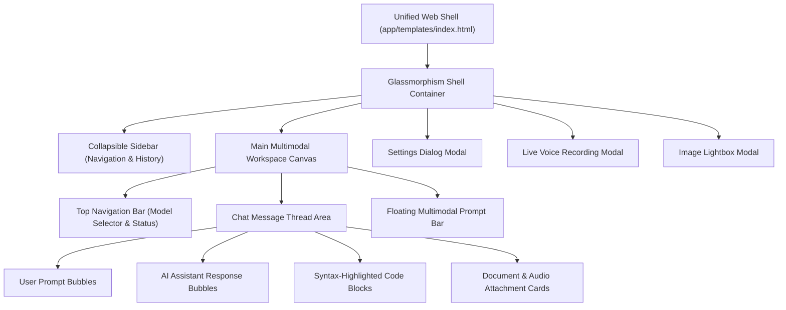
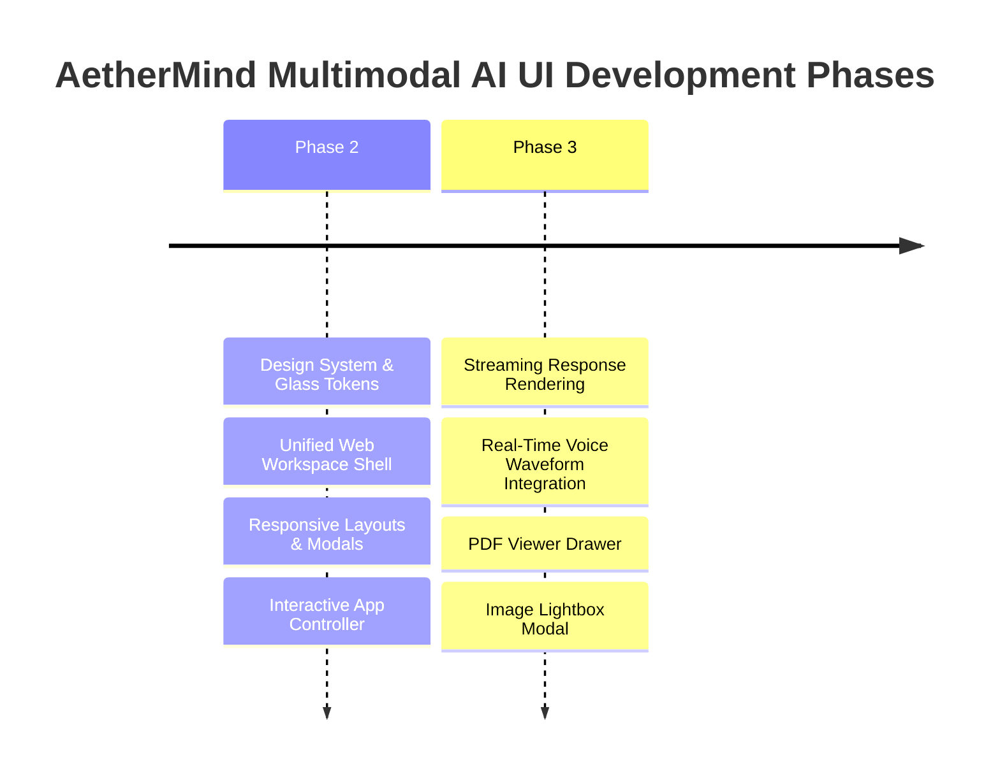

# 🎨 AetherMind Multimodal AI — Phase 2 Enterprise UI/UX Design System Blueprint

> **System Overview:** Premium Enterprise UI/UX Design System & Unified Single Page Workspace Shell  
> **Design Paradigm:** Dark-First Glassmorphism, Modern Micro-Animations, Accessible Typography & Reactive Layouts  
> **Status:** Phase 2 UI/UX Foundation Complete  

---

## 1. Complete UI Architecture



---

## 2. Complete Design System Tokens

All design tokens are centralized in `app/static/css/styles.css`:

```css
:root {
  /* Surface Colors */
  --bg-dark-root: #07090e;
  --bg-dark-surface: #0e131f;
  --bg-dark-glass: rgba(14, 19, 31, 0.75);
  --bg-dark-glass-border: rgba(255, 255, 255, 0.08);
  --bg-dark-card: rgba(21, 28, 45, 0.6);

  /* Accents */
  --accent-cyan: #06b6d4;
  --accent-indigo: #6366f1;
  --accent-purple: #8b5cf6;

  /* Typography */
  --font-sans: 'Inter', system-ui, sans-serif;
  --font-heading: 'Outfit', var(--font-sans);
  --font-mono: 'Fira Code', monospace;
}
```

---

## 3. Color Palette Specifications

| Token | Hex / Value | Role | Usage |
| :--- | :--- | :--- | :--- |
| Root Canvas | `#07090e` | Deep Space Dark Background | Main window background |
| Surface Glass | `rgba(14, 19, 31, 0.75)` | Glassmorphism Surface | Sidebar, TopNav, Floating Input |
| Cyan Accent | `#06b6d4` | Primary Brand Accent | Active pills, submit buttons, text highlights |
| Indigo Accent | `#6366f1` | Secondary Brand Gradient | Button gradients & focus borders |
| Purple Accent | `#8b5cf6` | Multimodal Voice & AI Accent | Voice mode pill, AI avatars |
| Emerald Accent | `#10b981` | Online & Success Status | Live search badge, upload success |

---

## 4. Typography Guide

- **Headings (Outfit):** Bold, tracking-tight, applied to app branding, modal titles, and section headers.
- **Body Text (Inter):** Clean 14px / 16px sans-serif with optimized line-height (`1.6`) for high readability during long AI chat streaming.
- **Code & Logs (Fira Code):** Monospaced font with clean ligatures for code blocks and JSON payloads.

---

## 5. Component Library

Defined in `app/components/ui_registry.py`:
1. **Buttons:** Primary Gradient (`bg-gradient-to-r from-cyan-500 to-indigo-600`), Glass Secondary, Ghost Icon buttons.
2. **Cards:** Glass Panels with `backdrop-filter: blur(16px)` and subtle hover borders.
3. **Inputs:** Auto-expanding text area with transparent background and glow focus ring.
4. **Modals:** Centered backdrop-blur overlay containers for Settings, Live Voice, and Image Lightbox.
5. **Attachment Pills:** Compact preview cards with mime-type icons and file sizes.

---

## 6. Layout Hierarchy

- **Sidebar:** Width 288px (`w-72`), collapsible to 0px on mobile or via toggle button.
- **Top Bar:** Fixed height 64px (`h-16`) containing model selector, status indicators, and voice mode launcher.
- **Chat Thread:** Centered max-width 896px (`max-w-4xl`) with automatic bottom scroll auto-anchor.
- **Floating Input Bar:** Bottom pinned container with auto-resizing prompt input and quick action triggers.

---

## 7. Responsive Strategy

- **Desktop (>=1024px):** Full expanded sidebar, side-by-side modal panels, multi-column settings.
- **Tablet (768px - 1023px):** Overlay sidebar, auto-collapsing drawer on item selection.
- **Mobile (<768px):** Full-bleed chat view, bottom drawer modals, touch-optimized attachment buttons.

---

## 8. Animation Strategy

- **Fade-In Scale:** Modals open with `cubic-bezier(0.16, 1, 0.3, 1)` scale-up transitions.
- **Typing Indicator:** 3-dot bouncing sequence for AI streaming preparation.
- **Audio Waveform:** Animated bar height oscillation for active voice recording.

---

## 9. Accessibility Standards

- **Color Contrast:** AA Standard compliant text contrast against `#07090e` dark root.
- **Focus Rings:** Visible `focus:border-cyan-500` outline on interactive buttons and inputs.
- **ARIA Attributes:** Screen reader friendly labels for icon-only action triggers.

---

## 10. UI Development Roadmap



---

> [!IMPORTANT]
> **PHASE 2 COMPLETE.**  
> The complete UI/UX Design System, Glassmorphism CSS tokens, interactive app controller, component specs, and single-page workspace template are established. Awaiting user approval before proceeding to Phase 3.
